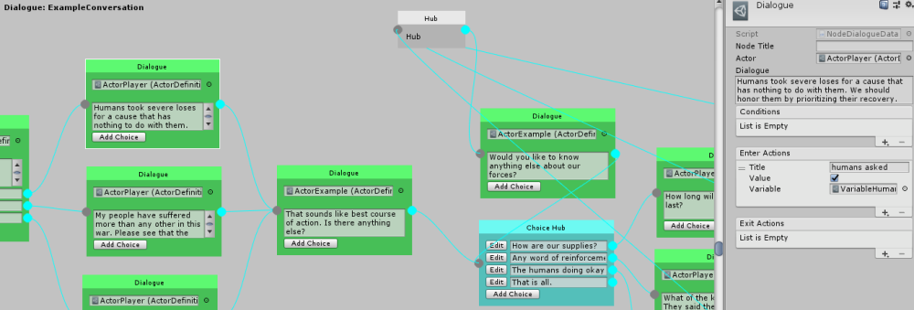

# Fluid Dialogue

A Unity dialogue system that features an easy to use drag and drop graph. ScriptableObject driven with the ability to write custom actions and conditions to create complex dialogue workflows.

* **Visual graph** editor
* Ability to create custom **actions** that execute as dialogue progresses
* Create custom **conditions** to determine how dialogue branches
* Built in **local database** to set and check variables for branching
* Allows you to **bring your own UI** or use a starter example (event driven dialogue presentation)
* Includes a simple [spell check](https://github.com/ashblue/unity-simple-spellcheck) tool that evaluates all dialogue nodes



**Support**

Join the [Discord Community](https://discord.gg/8QHFfzn) if you have questions or need help.

See upcoming features and development progress on the [Trello Board](https://trello.com/b/wMrsWyxn/fluid-dialogue).

## Getting Started

First you'll need to [install](#installation) the package with Unity Package Manager. After that you can create a database as follows.

1. Right click on the project window
1. Create -> Fluid -> Dialogue -> Graph
1. Click "Edit Dialogue" to customize your graph

To create a custom UI to display your graph, you'll need to handle a series of events emitted by the dialogue controller. You can find a full example of this in the [Examples](#examples) folder. 

### Node Types

There are a few different node types. Each with a specific focus in mind.

* Dialogue: Choices and text from a specific actor
* Hub: Used to route dialogue logic without triggering any dialogue or choices
* Choice Hub: Used to trigger a set of choices multiple times

### Actors

Every dialogue should have an actor assigned to it. Actors can be created with the following steps.

1. Right click on the project window
1. Create -> Fluid -> Dialogue -> Actor

### Actions

Actions can be added after selecting a node. They can be triggered before a node activates (enter actions) or after a node is complete (exit actions). Note that actions can activate with a delay.

### Conditions

Conditions are just like actions. Except if any of them return false the node will be skipped at runtime until it's evaluated again.

### Local Variables

To create a local variable and use it do the following.

1. Right click on the project window
1. Create -> Fluid -> Database -> Choose a variable type

To use the variable simply select a node on the graph. Then click the plus sign on a condition (variable checks) or action (change variable value) in the inspector. Please note you must assign the variable you just created to use it.

### Global Variables

Globals are mostly the same as local variables. The difference is these will be saved to a global database that persists after the conversation is over and can be referenced across multiple conversations.

The GlobalDatabaseManager will be marked DoNotDestroyOnLoad to persist between scene loads. If you want to save it and write the contents to a file run `Save()` to return a string. You can then restore the database simply by calling `Load(returned save string)`.

### Examples

To see the entire Fluid Dialogue workflow, it's highly recommended that you download this repo and run projects in the `Assets/Examples` folder.

## Installation

Fluid Dialogue is used through [Unity's Package Manager](https://docs.unity3d.com/Manual/CustomPackages.html). In order to use it you'll need to add the following lines to your `Packages/manifest.json` file. After that you'll be able to visually control what specific version of Fluid Dialogue you're using from the package manager window in Unity. This has to be done so your Unity editor can connect to NPM's package registry.

```json
{
  "scopedRegistries": [
    {
      "name": "NPM",
      "url": "https://registry.npmjs.org",
      "scopes": [
        "com.fluid"
      ]
    }
  ],
  "dependencies": {
    "com.fluid.dialogue": "1.0.0"
  }
}
```

## APIs

The following APIs are available for customizing your dialogue experience.

### Custom Actions

You can create your own custom actions for the dialogue tree with the following API syntax.

```c#
using CleverCrow.Fluid.Dialogues.Actions;
using CleverCrow.Fluid.Dialogues;

[CreateMenu("Custom/My Action")]
public class CustomAction : ActionDataBase {
    public override void OnInit (IDialogueController dialogue) {
        // Run the first time the action is triggered
    }

    public override void OnStart () {
        // Runs when the action begins triggering
    }

    public override ActionStatus OnUpdate () {
        // Runs when the action begins triggering

        // Return continue to span multiple frames
        return ActionStatus.Success;
    }

    public override void OnExit () {
        // Runs when the actions `OnUpdate()` returns `ActionStatus.Success`
    }

    public override void OnReset () {
        // Runs after a node has fully run through the start, update, and exit cycle
    }
}
```

### Custom Conditions

Custom conditions can be crafted with the following API.

```c#
using CleverCrow.Fluid.Dialogues;
using CleverCrow.Fluid.Dialogues.Conditions;
using CleverCrow.Fluid.Dialogues.Nodes;

public class CustomCondition : ConditionDataBase {
    public override void OnInit (IDialogueController dialogue) {
        // Triggered on first time setup
    }

    public override bool OnGetIsValid (INode parent) {
        // Place node condition logic here
        return true;
    }
}
```

## Releases

Archives of specific versions and release notes are available on the [releases page](https://github.com/ashblue/fluid-dialogue/releases).

## Nightly Builds

To access nightly builds of the `develop` branch that are package manager friendly, you'll need to manually edit your `Packages/manifest.json` as so. 

```json
{
    "dependencies": {
      "com.fluid.dialogue": "https://github.com/ashblue/fluid-dialogue.git#nightly"
    }
}
```

Note that to get a newer nightly build you must delete this line and any related lock data in the manifest, let Unity rebuild, then add it back. As Unity locks the commit hash for Git urls as packages.

## Development Environment

If you wish to run to run the development environment you'll need to install the latest [node.js](https://nodejs.org/en/). Then run the following from the root once.

`npm install`

If you wish to create a build run `npm run build` from the root and it will populate the `dist` folder.

### Making Commits

All commits should be made using [Commitizen](https://github.com/commitizen/cz-cli) (which is automatically installed when running `npm install`). Commits are automatically compiled to version numbers on release so this is very important. PRs that don't have Commitizen based commits will be rejected.

To make a commit type the following into a terminal from the root

```bash
npm run commit
```

---

This project was generated with [Oyster Package Generator](https://github.com/ashblue/oyster-package-generator).
